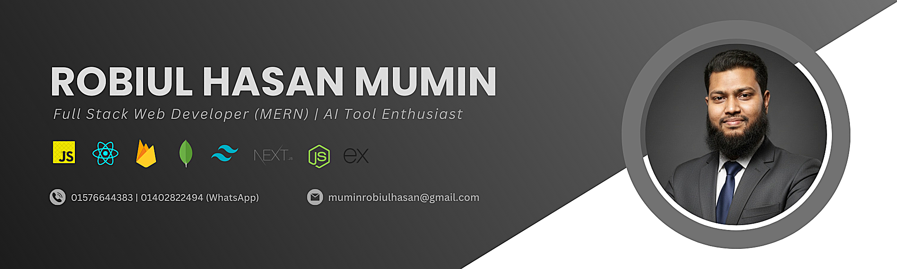

# Hi there! 👋 I'm "Robiul Hasan Mumin"

### **Passionate Full Stack Web Developer (MERN) | Front-end Developer | JavaScript Enthusiast**

---

### **📖 About Me**
I am a passionate **Full Stack Web Developer (MERN)** from Bangladesh. I love building clean, modern, and user-friendly web applications. My goal is to combine technical skills with AI-driven efficiency to create high-quality digital solutions.

* 🚀 I’m currently exploring **Next.js** to build more performant applications.
* 💻 I’m working on a **Portfolio Website** and a **MERN Stack LocaleChefBazar Food Delivery** project.
* 🤖 I regularly experiment with various **AI tools** to speed up development.
* 📫 How to reach me: [muminrobiulhasan@gmail.com](mailto:muminrobiulhasan@gmail.com)

---

### **🛠️ TECHNOLOGY STACK:**

#### **Languages:**

  

#### **CSS Frameworks & Libraries:**

  

#### **JavaScript Frameworks & Libraries:**

  

#### **Database & Backend Services:**

  

### **DEPLOYMENT & HOSTING:**

  

### **DESIGN & GRAPHICS:**

  

### **🛠️ TOOLS & TECHNOLOGIES:**

  

### **🤖 AI & MODERN DEVELOPMENT TOOLS:**

  
  
  
  
  
  
  

---

### **📊 GitHub Stats**

  
  

  

---

### **🔗 Connect with Me**

  
  
  
  

---

### **⚡ Fun Fact**
> "I often start a task thinking it's a '5-minute fix,' only to find myself deep in a debugging rabbit hole three hours later! To me, **Coffee** isn't just a drink—it's the essential fuel for converting complex logic into working code."

### **💬 Developer Quotes**
> *"First, solve the problem. Then, write the code."* — **John Johnson**

> *"Talk is cheap. Show me the code."* — **Linus Torvalds**

> *"Software is a great combination between artistry and engineering."* — **Bill Gates**
